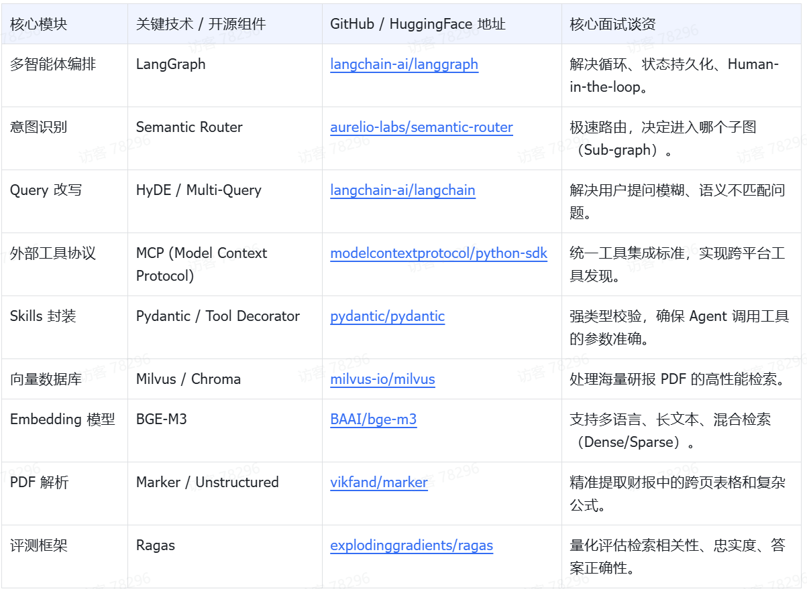
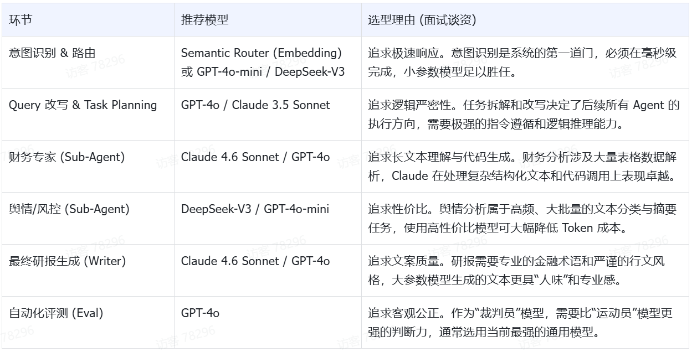
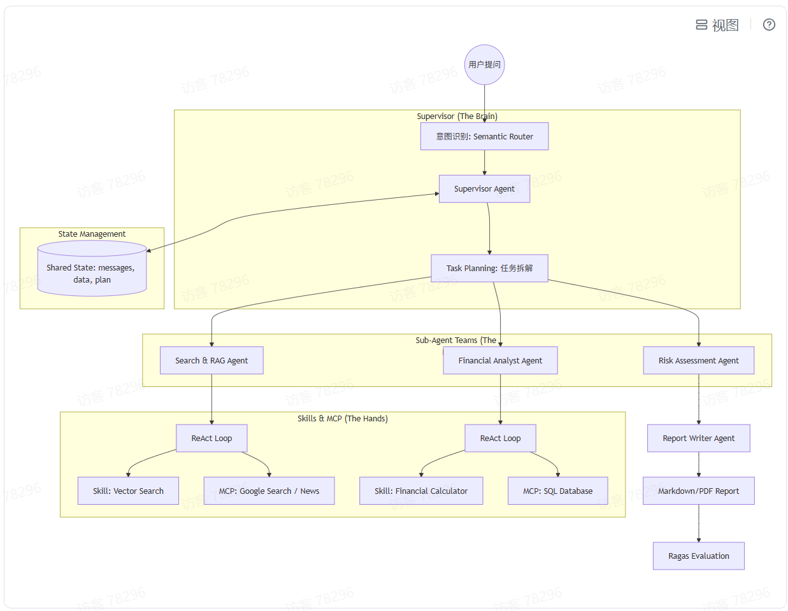
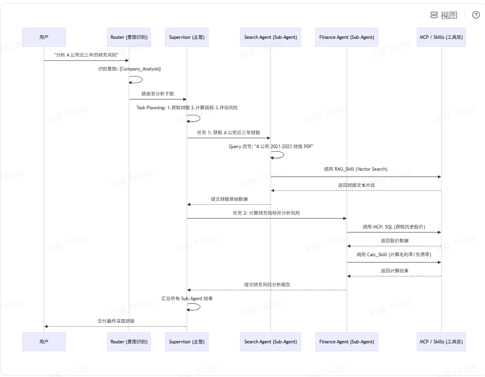

张锐-企业级智能投研与研报自动化助手 (Enterprise AI Investment Research Agent) 全栈实战方案
1. 项目背景与业务场景 (The Business Value)
在金融投研领域，分析师面临海量财报、新闻、研报的提取压力。本项目构建一个 Multi-Agent 系统，自动完成从“用户提问”到“深度研究报告生成”的全流程。
核心业务流程：
1.意图识别与任务拆解：识别用户是想看行业综述、个股对比还是财报解读。
2.多源数据检索 (RAG)：从本地 PDF 研报库、向量数据库中检索历史数据。
3.实时数据获取 (MCP)：通过 MCP 协议调用外部金融 API 获取最新股价、新闻。
4.深度分析与推理：多角色 Agent（财务专家、风控专家）协作讨论。
5.报告生成与评测：自动生成 Markdown 格式研报，并进行 Ragas 自动化评测。
2. 核心技术清单 (Tech Stack Inventory)

3. 模型选型矩阵 (LLM Selection Matrix)

4. 深度架构设计 (Hierarchical Architecture)

4. 业务时序设计 (Sequence Design)

5. 核心模块技术实现细节 (面试必谈)
5.1 Query 改写与意图识别 (The Input)
•技术实现：使用 Semantic Router 进行极速意图识别。采用 HyDE (Hypothetical Document Embeddings) 提升 RAG 召回率。
•面试点：如何通过 Few-shot Prompting 引导模型识别金融领域的特定意图。
5.2 RAG 深度优化 (The Knowledge)
•技术实现：针对财报中的表格数据，利用 Marker 转换为 Markdown 格式，并结合 Table-RAG 技术进行精准问答。
•面试点：如何处理跨页表格？如何解决检索回来的信息碎片化问题？
5.3 Supervisor 与 Sub-Agent (The Orchestration)
•Supervisor：不直接干活，只负责任务分配和结果审核。
•Sub-Agent：每个 Agent 都是一个独立的 ReAct 节点。它们拥有自己的私有 Prompt 和工具集。
•面试点：为什么用 Supervisor 而不是简单 Chain？（处理复杂分支、动态调整任务）。
5.4 Skills 与 MCP (The Execution)
•Skills：使用 Pydantic 定义工具的 args_schema。
•MCP：通过 MCP 协议实现工具的“即插即用”。
•面试点：为什么不让 LLM 直接算数？（数学幻觉问题）。如何通过 ReAct 模式让 Agent 在工具调用失败时自动重试？
6. 学习路径建议
1.Week 1: 基础 RAG 搭建（PDF 解析 + 向量库 + 简单检索）。
2.Week 2: 引入 MCP 协议与自定义 Skills（实时数据获取 + 财务计算器）。
3.Week 3: LangGraph 核心开发（多 Agent 协作流 + 状态机设计）。
4.Week 4: 进阶优化（Query 改写 + Rerank + Ragas 自动化评测）。
7. 面试价值总结
学员完成该项目后，可以自信地回答以下问题：
1.架构设计：为什么选择 Hierarchical（层级）架构？
2.工程落地：如何解决 RAG 中的幻觉问题？（通过 Rerank + 引用溯源）。
3.前沿技术：MCP 协议在企业级 Agent 开发中解决了什么痛点？
4.可靠性：如何通过 LangGraph 的 Checkpoints 实现长流程任务的断点续传？